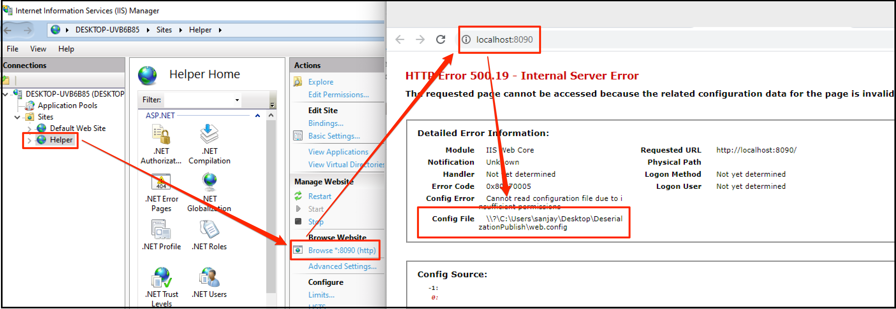

**Step 1:** Install the pre-requisite using "setup.bat" file.  

  

**Step 2:** Open the project in visual studio and install the "Nuget Packages". 

  

**Step 3:** Publish the website in local system. 

  

**Step 4:** Create the website using IIS Manager. 

  

**Step 5:** Open the website and observe permission error. 

  

**Step 6:** Fix the permission issue. 

  

**Step 7:** Open the website. 

