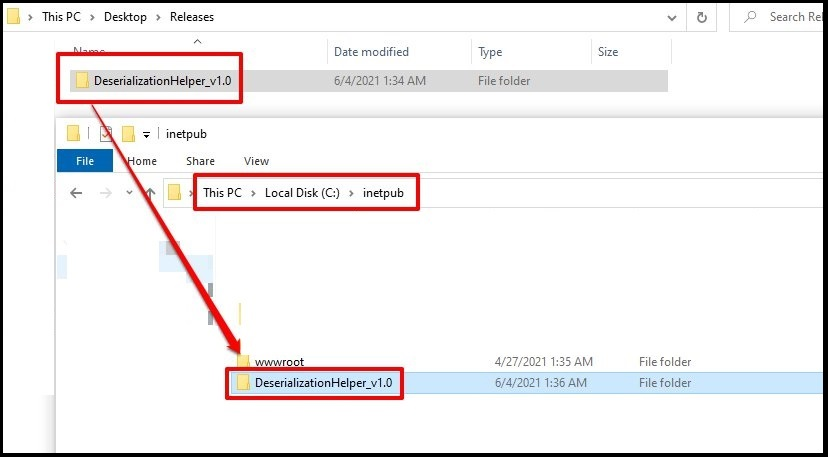
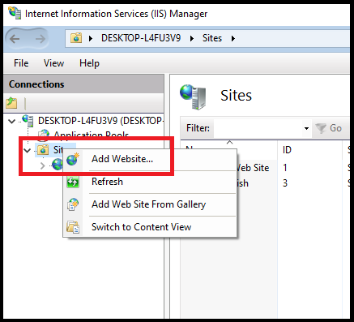
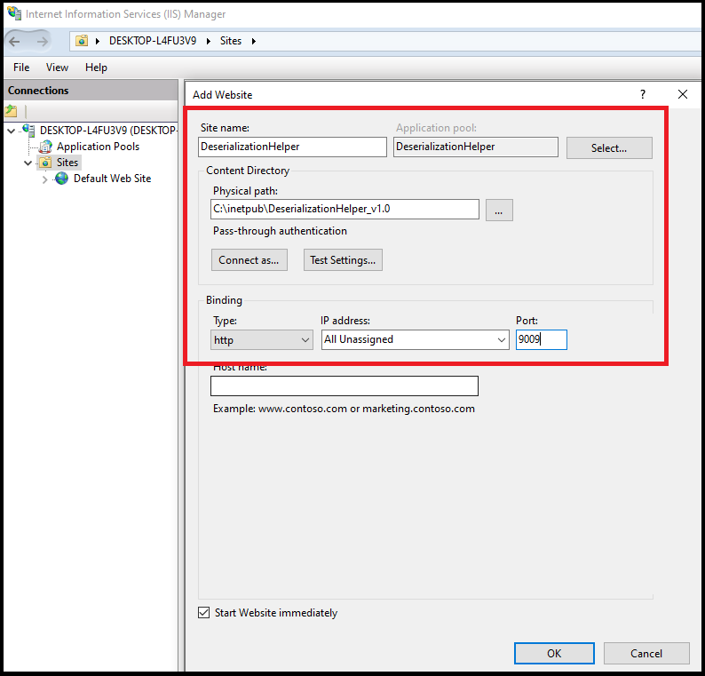
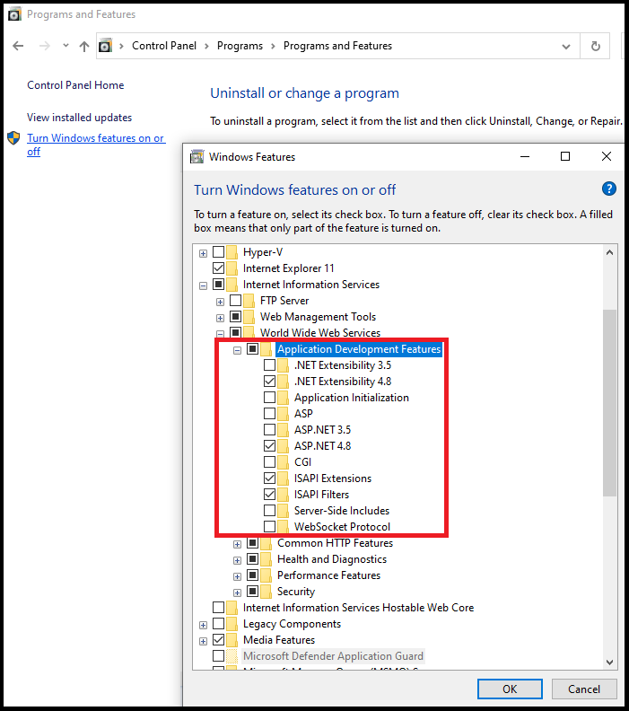
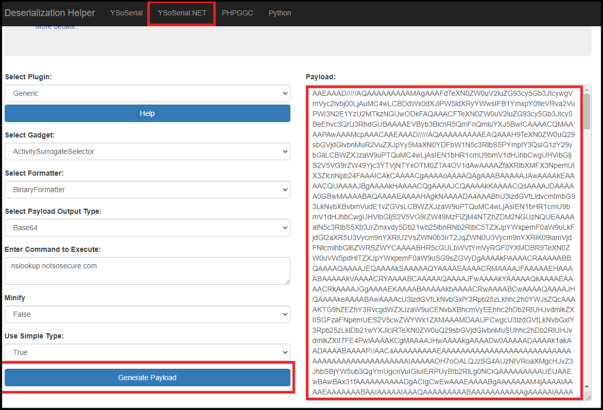
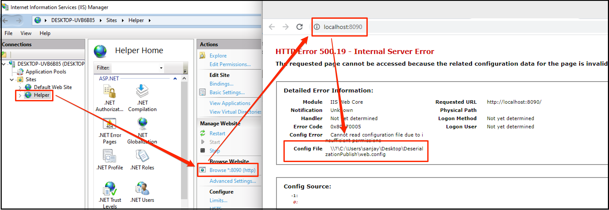
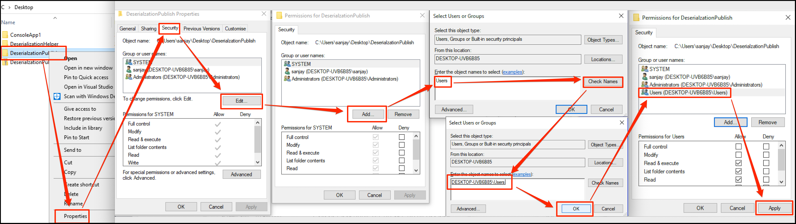

**Step 1:** Download the latest relaese from the release tab. 

  

**Step 2:** Create the website using IIS Manager. 

  

**Step 3:** Provide the website information. 

  

**Step 4:** Please check that the following packages are installed in IIS before browsing the application.

  

**Step 5:** Browse the application. 

  

**Step 6:** Navigates to the options and generate the payload 

  

**Step 7:** If you face any permission issues as shown below 

  

**Step 8:** It is require to fix the permission as shown below 

  

**References:**

- https://github.com/frohoff/ysoserial
- https://github.com/pwntester/ysoserial.net
- https://github.com/ambionics/phpggc
- https://windows.php.net/downloads/releases/php-8.0.7-Win32-vs16-x64.zip
- https://github.com/AdoptOpenJDK/openjdk8-binaries/releases/download/jdk8u292-b10/OpenJDK8U-jre_x86-32_windows_hotspot_8u292b10.zip
- https://www.python.org/ftp/python/3.9.5/python-3.9.5-embed-amd64.zip