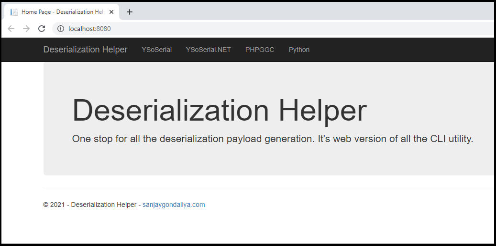

DeserializationHelper can be used to quickly setup YSoSerial, YSoSerial.Net, PHPGGC, and other tools. Using this tool, you will be able to generate Deserialization Payload via web frontend. 

## Prerequisite

- Windows OS

## Installation

1. Download the latest relaese from the release tab.
    

2. Create the website using IIS Manager.

    

3. Provide the website information
    

4. Please check that the following packages are installed in IIS before browsing the application.
   

5. Browse the application.
    

6. Navigates to the options and generate the payload
    
    
## Troubleshooting

If you face any permission issues as shown below.
    

You can fix the permission by following the steps as shown in below screenshot.
   

## References

- https://github.com/frohoff/ysoserial
- https://github.com/pwntester/ysoserial.net
- https://github.com/ambionics/phpggc
- https://windows.php.net/downloads/releases/php-8.0.7-Win32-vs16-x64.zip
- https://github.com/AdoptOpenJDK/openjdk8-binaries/releases/download/jdk8u292-b10/OpenJDK8U-jre_x86-32_windows_hotspot_8u292b10.zip
- https://www.python.org/ftp/python/3.9.5/python-3.9.5-embed-amd64.zip
