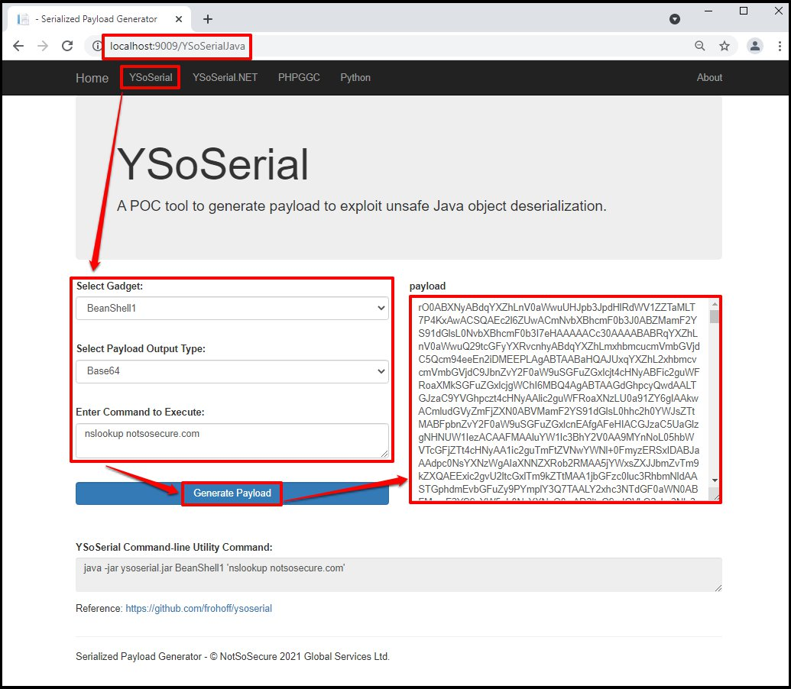

It's Web Interface to generate payload using various deserialization exploitation framework

## Description

During the pentesting engagement of the application which are built in different programing langauge. In order to exploit the deserialization vulnerability it is require to setup different tools like YSoSerial(Java), YSoSerial.NET, PHPGGC and it's pre-requisite. DeserializationHelper is the web interface which contains the support for YSoSerial(Java), YSoSerial.Net, PHPGGC, and other tools. Using the web interface you can generate the deserialization payload for various framework. 

## Desclaimer

This tool is not intended to be used to attack systems except where explicitly authorized. We are not responsible or liable for misuse of the software. Please use it responsibly.

## Prerequisite

- Windows OS

## Installation

- To build the source code
    - Follow the [build guide](Usage/Build.md)     
- To install the latest released version
    - Follow the [deployment guide](Usage/Deployment.md)
- Web.config Permission Issue
    - Follow the [Permission issue guide](Usage/IIS_Permission.md)  
- Directory Issue
    - Follow the [Directory Listing issue guide](Usage/DirectoryListing.md)   

## Usage

Navigate to the link for which you want to generate the payload. For example, In order to generate YSoSerial Deserialization payload then use "YSoSerial" tab as shown below:

## References

- https://notsosecure.com/remote-code-execution-via-php-unserialize/
- https://notsosecure.com/exploiting-viewstate-deserialization-using-blacklist3r-and-ysoserial-net/
- https://github.com/frohoff/ysoserial
- https://github.com/pwntester/ysoserial.net
- https://github.com/ambionics/phpggc
- https://windows.php.net/downloads/releases/php-8.0.7-Win32-vs16-x64.zip
- https://github.com/AdoptOpenJDK/openjdk8-binaries/releases/download/jdk8u292-b10/OpenJDK8U-jre_x86-32_windows_hotspot_8u292b10.zip
- https://www.python.org/ftp/python/3.9.5/python-3.9.5-embed-amd64.zip
