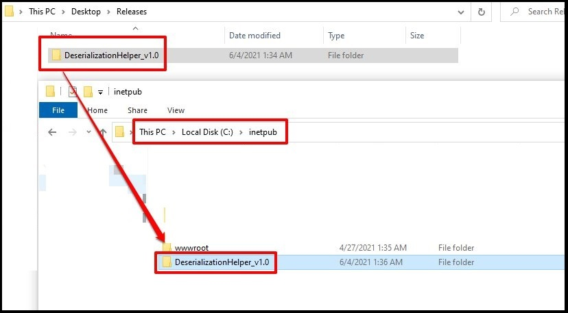
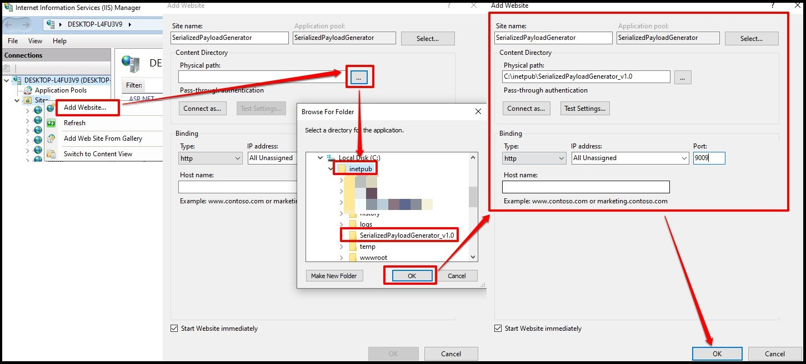
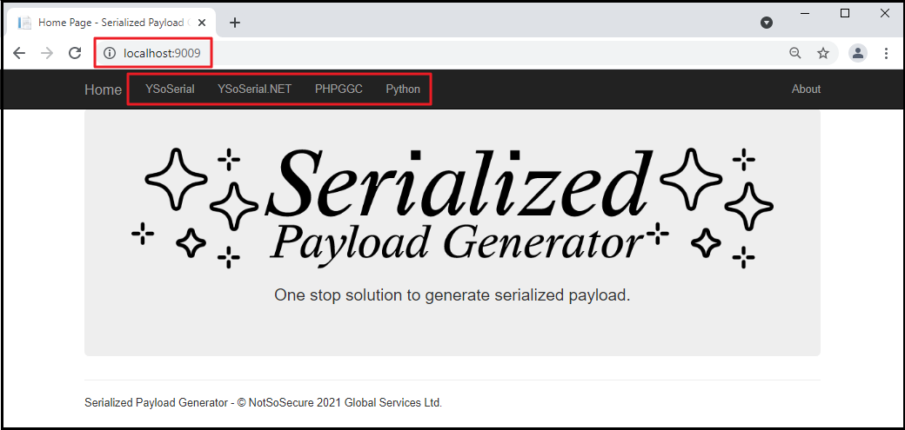
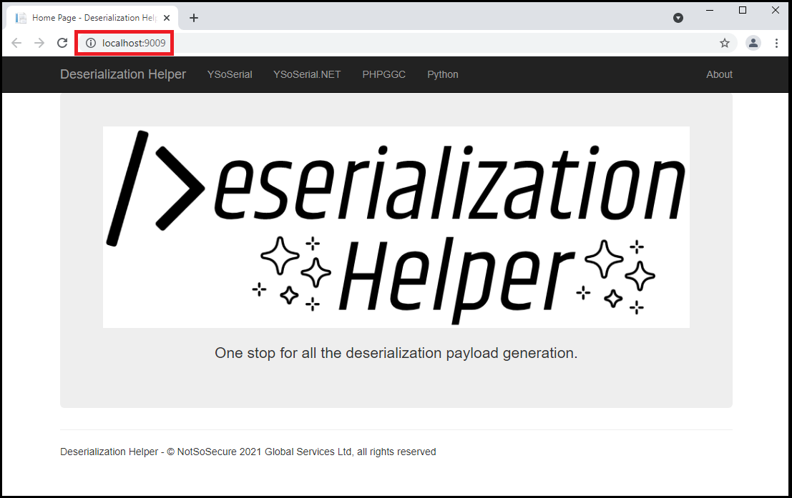

**Step 1:** Download the latest relaese from the release tab. 

  

**Step 2:** Create the website using IIS Manager. 

  

**Step 3:** Provide the website information. 

  

**Step 4:** Please check that the following packages are installed in IIS before browsing the application.

  

**Step 5:** Browse the application. 

