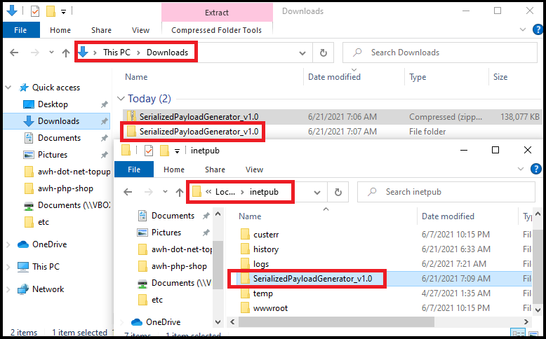

**Step 1:** Download the latest relaese from the [release page](https://github.com/NotSoSecure/DeserializationHelper/releases). 

  

**Step 2:** Create the website using IIS Manager and Provide the website information 

  

**Step 3:** Browse the application. 

